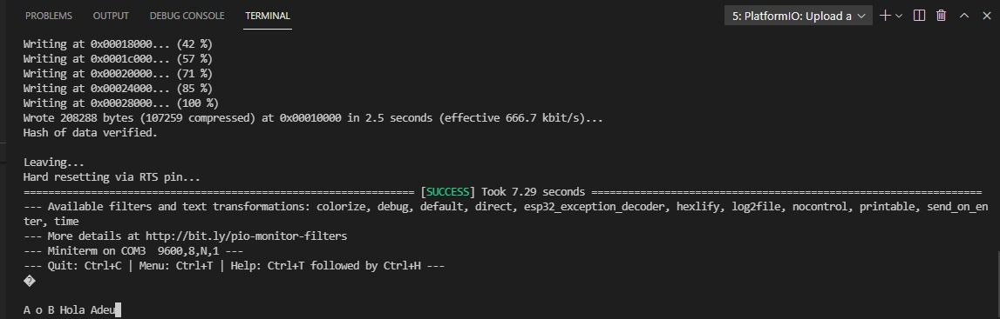

# PRACTICA 8: Buses de comunicación IV (uart)

### CODIGO
```

#include <Arduino.h>


void setup() {

  Serial.begin(9600);

  Serial2.begin(9600);
  
}


void loop() {

  if(Serial.available()){
    
    Serial2.print(Serial.read());
    
  }
    delay(100);

    if(Serial2.available()){

      Serial.print(Serial2.read());
    }
  
}

```
### Funcionamiento

En el loop es donde se realiza el bucle de comunicación. Tenemos dos serials inicializados, cuando nosotros mandemos datos por el terminal si el Serial esta disponible va a leer esos datos y estos se redirijiran el Serial2 que los imprimira . Seguidamente si el Serial2 esta disponible lo que hara es leer estos datos y se los reenviara al primer serial para que este los vuelva a mostrar por el terminal.

### Salidas y entradas

A continuación podemos ver el resultado de la salida por el puerto serie en escribir "A o B Hola Adeu":


<!--Images-->

